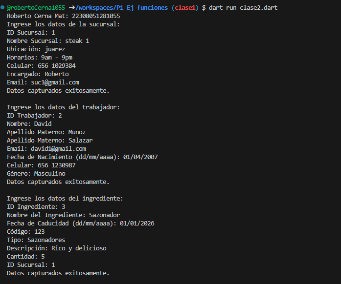
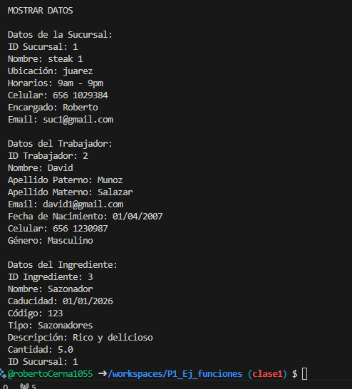

crear una clase Sucursal con atributos (id_sucursal, nombre_sucursal, ubicacion, horarios, celular, encargado, email), una función captura() desde la interfaz y otra mostrar datos(), crear la instancia y utilizar los atributos y llamadas a funciones lenguaje dart

crear una clase Trabajadores con atributos (id_trabajador, nombre_trabajador, apellido_p, apellido_m, email, fecha_de_nacimiento, celular, genero), una función captura() desde la interfaz y otra mostrar datos(), crear la instancia y utilizar los atributos y llamadas a funciones lenguaje dart

crear una clase Ingredientes con atributos (id_ingrediente, nombre_ingrediente, caducidad, codigo, tipo, descripcion, cantidad, id_sucursal), una función captura() desde la interfaz y otra mostrar datos(), crear la instancia y utilizar los atributos y llamadas a funciones lenguaje dart

Salida de datos

Captura

Mostrar datos

