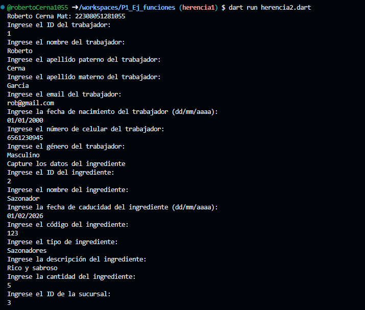
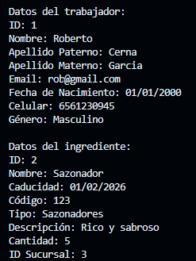

- crear la clase Trabajadores con los atributos (id_trabajador, nombre_trabajador, apellido_P, apellido_M, email, fecha_de_nacimiento, celular, genero) con una función capturadatos(), con interacción de interfaz de usuario. crear la clase DatosTrabajador con herencia Trabajadores y una función mostrarDatos(). lenguaje dart

- crear la clase Ingredientes con los atributos (id_ingrediente, nombre_ingrediente, caducidad, codigo, tipo, descripcion, cantidad, id_sucursal) con una función capturadatos(), con interacción de interfaz de usuario. crear la clase DatosIngrediente con herencia Ingredientes y una función mostrarDatos(). lenguaje dart

- Salida de datos 

- 
- 