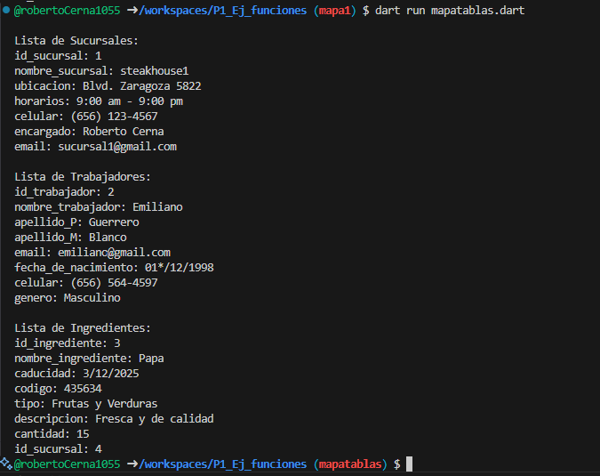

- crear map <string, dynamic> sucursales con los siguientes key, id_sucursal, nombre_sucursal, ubicacion, horarios, celular, encargado, email y mostrar los datos con un for each. lenguaje dart

- crear map <string, dynamic> trabajadores con los siguientes key, id_trabajador, nombre_trabajador, apellido_P, apellido_M, email, fecha_de_nacimiento, celular, genero y mostrar los datos con un for each. lenguaje dart

- crear map <string, dynamic> ingredientes con los siguientes key, id_ingrediente, nombre_ingrediente, caducidad, codigo, tipo, descripcion, cantidad, id_sucursal y mostrar los datos con un for each. lenguaje dart

- salida de datos

